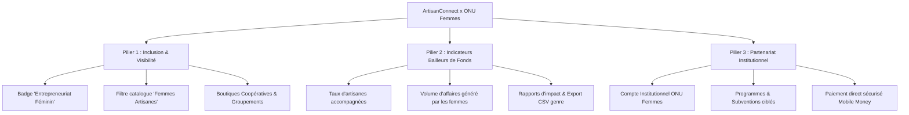

# Plan Stratégique : Intégration & Synergie ONU Femmes (BuyFromWomen)

## 1. Contexte & Opportunité

L'initiative **BuyFromWomen** d'**ONU Femmes** vise à autonomiser économiquement les femmes artisanes et productrices en facilitant leur accès aux marchés, à la finance inclusive et aux compétences numériques.

**ArtisanConnect** se positionne comme le partenaire technique local au Cameroun pour opérationnaliser cette vision grâce à une plateforme déjà fonctionnelle.

---

## 2. Piliers d'Action du Plan

---

## 3. Feuille de Route d'Implémentation (Roadmap)

### Étape 1 : Adaptations Modèle & Données (Technique)
- [ ] **Attribut Genre / Profil** :
  - Ajouter un champ `gender` (`female`, `male`, `cooperative`) sur le profil utilisateur / artisan.
- [ ] **Badge & Filtre Catalogue** :
  - Ajout du badge « *Créatrice locale / Entrepreneuriat Féminin* » sur les fiches produits et services.
  - Filtre rapide dans le catalogue public pour les acheteurs responsables / commandes institutionnelles.

### Étape 2 : Espace Institutionnel & Métriques d'Impact (Bailleurs)
- [ ] **Indicateurs de genre dans `/institution`** :
  - % de femmes artisanes inscrites et actives ;
  - Nombre de dossiers de formalisation portés par des femmes ;
  - Volume de ventes encaissé par les femmes via le séquestre Orange Money.
- [ ] **Export des rapports d'impact désagrégés par genre** (conforme aux exigences des bailleurs de fonds internationaux).

### Étape 3 : Dispositifs & Programmes Dédiés (Institutionnel)
- [ ] Publication de programmes spécifiques : « *Fonds d'appui à l'artisanat féminin* », « *Formations numériques MINPROFF / ONU Femmes* ».
- [ ] Système de candidatures directes des artisanes avec sélection et validation par les comités de projets.

### Étape 4 : Dossier de Partenariat & Présentation Bailleurs
- [ ] Synthèse exécutive (Deck de présentation) démontrant qu'ArtisanConnect est la déclinaison opérationnelle de *BuyFromWomen* au Cameroun.
- [ ] Proposition de pilote / convention de partenariat avec le bureau pays d'ONU Femmes Cameroun et le MINPROFF.
